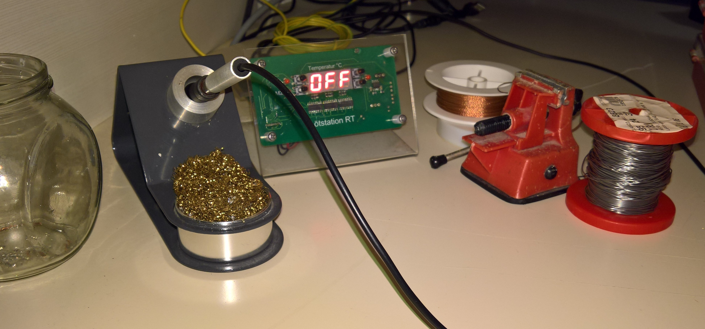

# Lötstation RT

A Soldering Station ("Lötstation" in German) for the Weller RT soldering tips. It was created a while ago in 2017, during my apprenticeship.

In this repo is just the code, but [here](https://oblaser.ch/projekte/loetstation-rt/) is a bit more.

